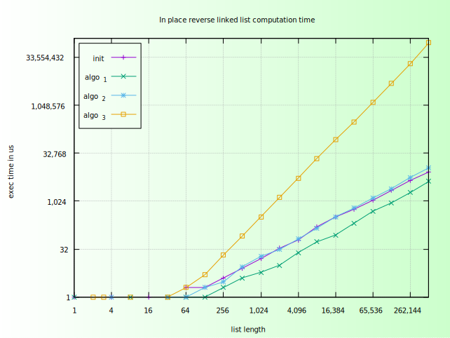

# Remarks on the performance measurements

The riddle **99_07: in place reverse linked list** is solved with three different algorithms. The first one is allowed to
use both heap and stack space without limitations, the second can only use stack space, and the last one cannot use heap
or stack (at least it cannot scale stack or heap space with the length of the list).

To get an idea of the performance impact I used all algorithm with lists of length:

1 2 4 8 16 32 64 128 256 1024 2048 .. 524288

The csv file `time_99_07.csv` holds the measured time in microseconds.

The file [p99_07_gnuplot_performance.gp](./p99_07_gnuplot_performance.gp) provides a gnuplot recipe to plot the performance from the csv file in a single graph.
Note that the created graph is logarithmic on both X and Y axis. It is shown here:

Here is the data for the graph above: [time_99_07.csv](./time_99_07.csv) which is measured on an Ubuntu Linux Core i5 PC. The code has been compiled with gcc without optimization.

Here is another graph created with the [p99_07_gnuplot_performance_tlr.gp](./p99_07_gnuplot_performance_tlr.gp) that shows the ratio between execution time and list length. It shows that the algorithms 1 and 2 are more or less 
linear (and so is the time for initializing the linked list) while the ratio goes up as the list gets longer:

The data for the graph above [time_99_07_mac_o2_1.csv](./time_99_07_mac_o2_1.csv) was measured on a Mac Book Air M4. The code has been compiled with clang with `-O2` optimization.
